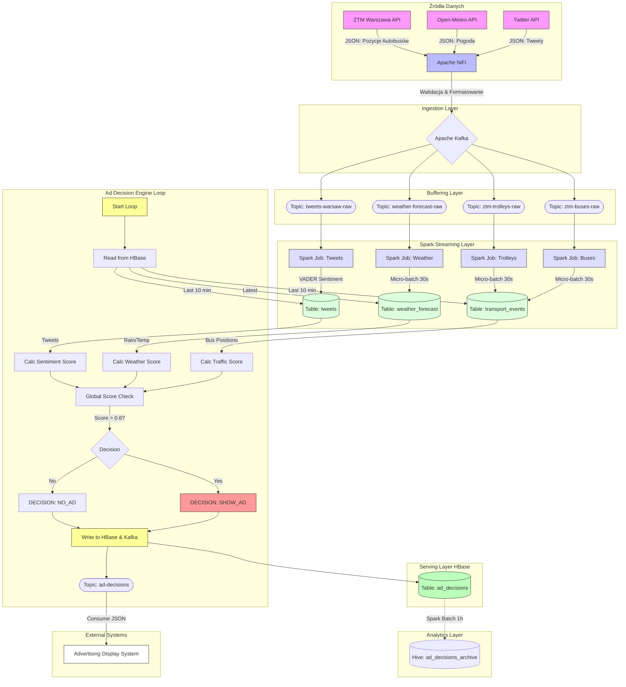

# Architektura Systemu Dynamicznej Reklamy

Dokument ten przedstawia szczegółowy przepływ danych oraz logikę decyzyjną systemu "Big Data Interactive Ads".

## Diagram Przepływu Danych

Poniższy diagram ilustruje drogę danych od zewnętrznych API, przez warstwy ingestion, buforowania i przetwarzania, aż do podjęcia decyzji reklamowej.

## Szczegółowy Opis Komponentów

### 1. Ingestion Layer (Apache NiFi)

Apache NiFi odpowiada za cykliczne odpytywanie zewnętrznych API.

- **Procesory**: `InvokeHTTP` pobiera dane, `EvaluateJsonPath` wyciąga kluczowe pola, `PublishKafka` wysyła dane do Kafki.
- **Bezpieczeństwo**: NiFi zarządza kluczami API (Twitter) i obsługuje połączenia HTTPS.

### 2. Buffering Layer (Apache Kafka)

Kafka działa jako bufor, zapewniając asynchroniczność i trwałość danych.

- **Tematy**:
  - `ztm-buses-raw`: Surowe dane o lokalizacji autobusów.
  - `weather-forecast-raw`: Dane pogodowe (temperatura, deszcz).
  - `tweets-warsaw-raw`: Tweety zawierające słowa kluczowe (korek, smog, złość).
  - **`ad-decisions`**: (NOWE) Wyniki decyzji reklamowych w czasie rzeczywistym, konsumowane przez systemy wyświetlające reklamy.

### 3. Processing Layer (Apache Spark Streaming)

W tej warstwie działa **równolegle 5 niezależnych aplikacji Spark**. Każda z nich:

1.  **Initializacja**: Łączy się z Kafką i subskrybuje odpowiedni temat.
2.  **Micro-batching**: Pobiera dane w małych paczkach (np. co 30 sekund).
3.  **Transformacja**:
    - Parsuje JSON z Kafki.
    - Dostosowuje typy danych (timestamp, float).
    - (Dla Tweetów) Wykonuje analizę sentymentu biblioteką VADER.
4.  **Zapis (Sink)**: Wykorzystuje `ForeachBatch` do zapisu przetworzonej paczki danych do tabel HBase za pomocą biblioteki `happybase` lub natywnego konektora.

### 4. Ad Decision Engine (Python Process)

Niezależny proces (`ad_campaign_manager.py`), który działa w pętli nieskończonej (interwał 1min). Jest to mózg operacyjny systemu.

#### Pętla Decyzyjna (Krok po Kroku)

1.  **Inicjacja Okna Czasowego**: Proces ustala zakres czasowy analizy na "ostatnie 10 minut" od `teraz`.
2.  **Skanowanie Danych (Data Fetching)**:
    - Pobiera historię pozycji autobusów z tabeli `transport_events`.
    - Pobiera najnowszą prognozę z `weather_forecast`.
    - Pobiera tweety z `tweets`.
3.  **Obliczanie Metryk (Scoring)**:
    - **Traffic Score**: Analizuje trasę każdego autobusu w oknie 10 min. Oblicza $V = \Delta S / \Delta t$. Jeśli $V < 15 km/h$, autobus jest w korku. Wynik to % stojących autobusów.
    - **Weather Score**: Analizuje deszcz i temperaturę. Deszcz > 0.5mm lub Temp < 10°C podnosi wynik "dyskomfortu".
    - **Sentiment Score**: Oblicza % tweetów o negatywnym sentymencie (zmapowany score < 4).
4.  **Agregacja (Aggregation)**:
    - Wylicza `Global Score` ze wzoru:
      $$ GlobalScore = 0.5 \cdot Traffic + 0.3 \cdot Weather + 0.2 \cdot Sentiment $$
5.  **Decyzja (Decision Logic)**:
    - Jeśli `Global Score > 0.6`, flaga `show_ad` = TRUE.
    - Typ kampanii ustawiany jest na `ESCAPISM_NOW`.
    - **Targeting**: System wybiera **5 najwolniej jadących pojazdów** (o prędkości > 0.1 km/h) i zapisuje ich ID jako cel.
6.  **Zapis i Dystrybucja (Persistance & Delivery)**:
    - **HBase**: Decyzja, wraz z metrykami, jest trwale zapisywana dla celów audytowych. `display_time` + 5min.
    - **Kafka**: Payload JSON z decyzją jest natychmiast wysyłany na temat `ad-decisions`. Ekrany reklamowe nasłuchują na ten temat i wyświetlają treść.

### 5. Analytics Layer (Hive Archiving)

Cykliczny job Spark Batch (`archive_to_hive.py`) uruchamiany **automatycznie co godzinę** (przez skrypt startowy):

- Pobiera decyzje z ostatniej godziny z HBase.
- Zapisuje je w zoptymalizowanej tabeli Hive `ad_decisions_archive` (na HDFS).
- Dane są partycjonowane po dacie (`dt`) i godzinie (`hr`), co umożliwia szybkie zapytania SQL o historyczną efektywność kampanii.
